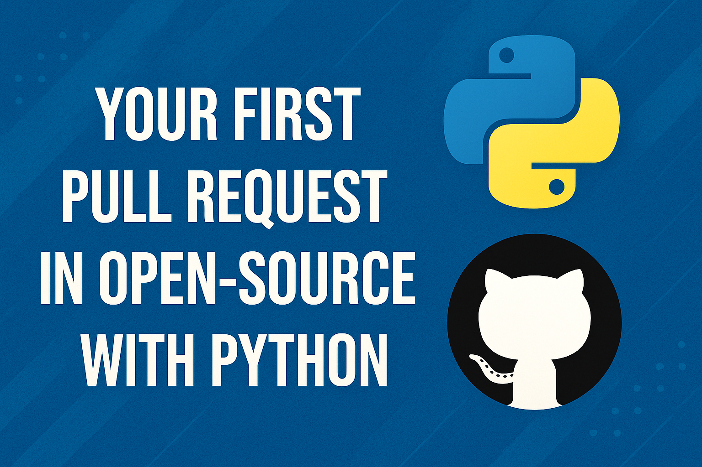

# 🐍 First Python Contributions

	

	<b>Welcome! This is the perfect place to take your first step into the open source world with Python.</b>

	🌟 <b>If you find this project helpful, please give us a star to support and help more people discover it!</b> 🌟

---

## ✨ What is this repository?

This repository is designed to help beginners make their first Pull Request (PR) by contributing a simple Python project. Whether you are new to Git/GitHub or just starting with Python, here you can begin your open source journey.

**No project is too small!** From a simple calculator to a utility script, every contribution counts and helps you learn the collaborative workflow.

---

## 🚀 How to contribute?

1. **Fork** this repository
2. **Add** your simple Python project
3. **Submit** a Pull Request

---

## 🌍 Participating Countries

We welcome contributors from all over the world! These are some of the countries represented in our community:

🇪🇨 🇮🇳 🇲🇽 🇵🇰

Want to add your country? Make a contribution and follow the instructions in [`/Colaborators/instructions.md`](./Colaborators/instructions.md) to join our collaborators list.

---

## 🌟 Contributors

Thanks to these amazing contributors who have participated in the project:

	
	
	
	
	
	
	

---

Thank you for being part of this learning and collaborative community! 💡
